# NSSC 2026 — Unsupervised Anomaly Detection in Mars HiRISE Orbital Imagery

[](https://nssc.in)
[]()
[]()
[-8E24AA?style=for-the-badge&logo=scikitlearn&logoColor=white)]()
[-D32F2F?style=for-the-badge)]()

---

### 📊 Executive Pipeline Summary

```
┌────────────────────────────────────────────────────────────────────────────────────────────────────────┐
│                                   MARS HiRISE ANOMALY DETECTION PIPELINE                               │
├───────────────────────┬─────────────────────────┬───────────────────────────┬──────────────────────────┤
│ 🛰️ Dataset Size       │ 🧠 Latent Compression   │ 🌲 Novelty Engine         │ 🎯 Statistical Cutoff    │
│ 10,422 Orbital Crops  │ 256-D Bottleneck Vector │ Isolation Forest (300-T)  │ Parametric τ = μ + 3σ    │
│ 227 × 227 Grayscale   │ Skip-Autoencoder (V3)   │ Score = -score_samples(z) │ τ = 0.626565             │
├───────────────────────┼─────────────────────────┼───────────────────────────┼──────────────────────────┤
│ 📉 Model Parameters   │ ⚡ Pure Val MSE (V3)    │ 🔍 Flagged Anomalies      │ 🏆 Top-1 Candidate       │
│ 30,416,929 (100% Train)│ 4.2304 × 10⁻⁵           │ 206 images (1.98%)        │ sample_06029.jpg         │
│ Zero Pretraining      │ 98.16% error reduction  │ 10,216 normal images      │ Novelty: 0.742821        │
└───────────────────────┴─────────────────────────┴───────────────────────────┴──────────────────────────┘
```

---

## 1. Project Overview

This repository contains the end-to-end unsupervised anomaly detection pipeline developed for the **National Students’ Space Challenge (NSSC 2026)**, IIT Kharagpur, for the Data Analytics challenge: *"Unsupervised Anomaly Detection in Mars HiRISE Orbital Imagery"*.

Orbital exploration missions such as the Mars Reconnaissance Orbiter (MRO) High Resolution Imaging Science Experiment (HiRISE) acquire massive volumes of high-resolution planetary surface imagery. Identifying rare, scientifically critical surface features (e.g., atypical volcanic vents, novel impact craters, unexpected erosional formations, and unique sediment outcrops) manually across tens of thousands of crops is practically infeasible. Furthermore, ground-truth anomaly labels do not exist for uncharted planetary surfaces.

The objective of this project is to build an entirely unsupervised pipeline that:
1. Learns a compact, robust latent representation of normal Martian surface morphology from unlabeled image crops using a custom convolutional autoencoder trained strictly from scratch.
2. Quantifies the degree of anomalousness (novelty) of every image in the dataset using an Isolation Forest in the learned latent space.
3. Establishes a statistically rigorous anomaly threshold derived directly from the empirical score distribution ($\mu + 3\sigma$).
4. Extracts and ranks the most anomalous image candidates (Top-5) for downstream scientific prioritization.
5. Provides pixel-level spatial interpretability via reconstruction error heatmaps.
6. Formulates geological hypotheses and correlates detections with orbital acquisition metadata.

> [!IMPORTANT]
> **Strict No-Pretraining Principle**: No pretrained backbones, pretrained weights, transfer learning, or external feature extractors (such as ImageNet models) were used at any stage of the pipeline. All feature representations were learned strictly from scratch on the provided Mars HiRISE dataset.

---

## 2. Problem Statement

The challenge presents an unlabeled orbital image dataset consisting of grayscale surface crops from Mars HiRISE observations. The dataset contains predominantly common surface morphologies (e.g., plains, regular cratering, standard ripple/dune patterns) alongside rare, injected or natural anomalous morphologies.

```mermaid
flowchart LR
    subgraph DataSpace["1. Input Data Space"]
        A["10,422 Unlabeled HiRISE Crops\n(227 × 227 Grayscale)"]
    end
    
    subgraph FeatureSpace["2. Deep Representation Learning"]
        B["Skip-Connected Autoencoder (V3)\nTrained from Scratch (No Pretraining)"]
        C["256-D Latent Embeddings\nZ ∈ ℝ^(10422 × 256)"]
    end
    
    subgraph NoveltySpace["3. Latent Novelty Scoring"]
        D["Isolation Forest Engine\n300 Isolation Trees"]
        E["Continuous Novelty Scores\nScore = -score_samples(z)"]
    end
    
    subgraph DecisionSpace["4. Statistical Filtering & Interpretability"]
        F["Parametric Decision Boundary\nτ = μ + 3σ = 0.626565"]
        G["206 Outliers (1.98%)\nTop-5 Candidates"]
        H["Pixel Error Heatmaps (x - x̂)²\n& Geological Hypotheses"]
    end
    
    A --> B --> C --> D --> E --> F --> G --> H
```



The primary engineering and scientific objectives addressed are:
- **Unsupervised Representation Learning**: Compress high-dimensional orbital imagery ($227 \times 227$ pixels) into a low-dimensional latent space ($d=256$) capturing geomorphological patterns without overfitting to noise or collapsing representations.
- **Novelty Detection without Labels**: Formulate an outlier scoring mechanism on latent features to rank images by their degree of statistical isolation.
- **Parametric Statistical Thresholding**: Define a principled anomaly boundary based on empirical distribution statistics ($\mu + 3\sigma$) rather than arbitrary contamination heuristics.
- **Interpretability & Error Localization**: Map latent anomalies back to image space using pixel-wise reconstruction error maps to isolate sub-features driving anomalousness.
- **Contextual Metadata Analysis**: Analyze orbital acquisition parameters (coordinates, solar angles, seasonal cycles, resolution) to differentiate acquisition artifacts from intrinsic surface novelty.

---

## 3. Dataset

### Dataset Specifications
- **Total Images**: 10,422 single-channel grayscale crops (`sample_00001.jpg` to `sample_10422.jpg`).
- **Spatial Resolution / Dimensions**: $227 \times 227$ pixels per crop.
- **Image Format**: JPEG (`.jpg`), single-channel grayscale (loaded as 8-bit L-mode).
- **Pixel Intensity Statistics (Raw uint8)**:
  - Minimum: `0.0`
  - Maximum: `255.0`
  - Mean: `118.439095`
  - Standard Deviation: `46.071037`
  - Median: `123.0`

### Metadata Schema
The dataset includes two accompanying metadata files:

```
┌─────────────────────────────────────────────────────────────────────────────────────────────────┐
│                                     METADATA RELATIONSHIP SCHEMA                                │
├──────────────────────────────────────────────────────┬──────────────────────────────────────────┤
│ 📄 crop_metadata_index.csv (10,422 rows × 2 cols)    │ 📄 source_image_metadata.csv (172 × 6)   │
├──────────────────────────────────────────────────────┼──────────────────────────────────────────┤
│ • filename         : string (e.g. 'sample_00001.jpg')│ • source_image_id : string (PK)          │
│ • source_image_id  : string (FK -> SRC_xxx) ─────────┼─► latitude        : float [-90.0, 90.0]  │
│                                                      │ • longitude       : float [0.0, 180.0]   │
│                                                      │ • sun_angle       : float [32.1°, 85.7°] │
│                                                      │ • season          : string (4 categories)│
│                                                      │ • resolution      : float (0.25/0.50/1.0)│
└──────────────────────────────────────────────────────┴──────────────────────────────────────────┘
```

### Preprocessing & Data Splitting
- **Preprocessing**: Images are standardized at $227 \times 227$ pixels. No synthetic resizing, cropping, padding, or artifact removal is applied, preserving authentic spatial fidelity.
- **Normalization**: Pixel values are cast from `uint8` $[0, 255]$ to `float32` $[0.0, 1.0]$ via division by $255.0$, adding a channel dimension to yield tensors of shape $(1, 227, 227)$.
- **Dataset Splitting**:
  - Training Set: 8,337 images (80.0%, 131 batches of batch size 64).
  - Validation Set: 2,085 images (20.0%, 33 batches of batch size 64).
  - Splitting Seed: `random_state=42`.

---

## 4. End-to-End Methodology

The pipeline follows a sequential, strictly validated eleven-stage workflow:

```mermaid
flowchart TD
    subgraph S1["Phase 1 — Deep Latent Compression"]
        P1["1. Preprocessing & Normalization\nuint8 [0, 255] → float32 [0.0, 1.0]\nTensor Shape: (B, 1, 227, 227)"]
        P2["2. Autoencoder Training from Scratch\n4-Stage Convolutional Architecture\nSplit: 8,337 Train / 2,085 Val (Seed 42)"]
        P3["3. Latent Representation Extraction\nExtract 256-D Bottleneck Vector Z\nLatent Matrix X ∈ ℝ^(10422 × 256)"]
        P4["4. Latent Space Visualization\nt-SNE 2D Diagnostic Projection\nPerplexity=30, init='pca', Seed 42"]
        P1 --> P2 --> P3 --> P4
    end

    subgraph S2["Phase 2 — Novelty Scoring & Thresholding"]
        P5["5. Isolation Forest Novelty Engine\n300 Trees, max_samples='auto'\nFit on full 10,422 × 256 Latent Space"]
        P6["6. Continuous Novelty Scoring\nNovelty Score = -score_samples(Z)\nHigher Score = Greater Anomalousness"]
        P7["7. Statistical Thresholding\nParametric Rule: τ = μ + 3σ\nτ = 0.626565 → 206 Anomalies (1.98%)"]
        P8["8. Top-5 Anomaly Selection\nFilter threshold-qualified set first\nRank descending by Novelty Score"]
        P4 --> P5 --> P6 --> P7 --> P8
    end

    subgraph S3["Phase 3 — Interpretability & Geological Analysis"]
        P9["9. Reconstruction Interpretability\nV3 Forward Pass & Pixel-wise\nSquared Error Heatmaps (x - x̂)²"]
        P10["10. Geological Interpretation\nObservational morphological hypotheses\nfor Top-5 candidates"]
        P11["11. Metadata & Location Analysis\nGeographic coords, sun angle, season,\nand 264-D Multimodal Fusion check"]
        P8 --> P9 --> P10 --> P11
    end
```



---

## 5. Model Architecture

The final selected model is **Autoencoder Version 3 (V3)**, utilizing a 4-stage skip-connected convolutional encoder-decoder architecture with a fully connected 256-dimensional bottleneck.

### 📐 Layer-by-Layer Architectural Blueprint

```
═══════════════════════════════════════════════════════════════════════════════════════════════
 INPUT: Normalized Orbital Crop (1 × 227 × 227)
═══════════════════════════════════════════════════════════════════════════════════════════════
                                │
                                ▼
 ┌─────────────────────────────────────────────────────────────┐
 │ ENCODER STAGE 1 (enc1)                                      │
 │ Conv2d(1 → 32, k=3, s=2, p=1) + ReLU                        │ ───► [Skip 1: 32×114×114] ───┐
 │ Output: (32 × 114 × 114)                                    │                              │
 └─────────────────────────────────────────────────────────────┘                              │
                                │                                                             │
                                ▼                                                             │
 ┌─────────────────────────────────────────────────────────────┐                              │
 │ ENCODER STAGE 2 (enc2)                                      │                              │
 │ Conv2d(32 → 64, k=3, s=2, p=1) + ReLU                       │ ───► [Skip 2: 64×57×57] ──┐  │
 │ Output: (64 × 57 × 57)                                      │                           │  │
 └─────────────────────────────────────────────────────────────┘                           │  │
                                │                                                          │  │
                                ▼                                                          │  │
 ┌─────────────────────────────────────────────────────────────┐                           │  │
 │ ENCODER STAGE 3 (enc3)                                      │                           │  │
 │ Conv2d(64 → 128, k=3, s=2, p=1) + ReLU                      │ ───► [Skip 3: 128×29×29] ─┼──┼──┐
 │ Output: (128 × 29 × 29)                                     │                           │  │  │
 └─────────────────────────────────────────────────────────────┘                           │  │  │
                                │                                                          │  │  │
                                ▼                                                          │  │  │
 ┌─────────────────────────────────────────────────────────────┐                           │  │  │
 │ ENCODER STAGE 4 (enc4)                                      │                           │  │  │
 │ Conv2d(128 → 256, k=3, s=2, p=1) + ReLU                     │                           │  │  │
 │ Output: (256 × 15 × 15)                                     │                           │  │  │
 └─────────────────────────────────────────────────────────────┘                           │  │  │
                                │                                                          │  │  │
                                ▼                                                          │  │  │
 ┌─────────────────────────────────────────────────────────────┐                           │  │  │
 │ LATENT BOTTLENECK                                           │                           │  │  │
 │ Flatten (57,600) ──► Linear(57,600 → 256) ──► Latent Z      │                           │  │  │
 │ Latent Z (256-D) ──► Linear(256 → 57,600) ──► Reshape       │                           │  │  │
 │ Output: (256 × 15 × 15)                                     │                           │  │  │
 └─────────────────────────────────────────────────────────────┘                           │  │  │
                                │                                                          │  │  │
                                ▼                                                          │  │  │
 ┌─────────────────────────────────────────────────────────────┐                           │  │  │
 │ DECODER STAGE 4 (dec4 + skip3)                              │                           │  │  │
 │ ConvTranspose2d(256 → 128, k=3, s=2, p=1, op=0) + ReLU      │                           │  │  │
 │ Concat [d4 (128×29×29), enc3 (128×29×29)]                   │ ◄─────────────────────────┘  │  │
 │ Output: (256 × 29 × 29)                                     │                              │  │
 └─────────────────────────────────────────────────────────────┘                              │  │
                                │                                                             │  │
                                ▼                                                             │  │
 ┌─────────────────────────────────────────────────────────────┐                              │  │
 │ DECODER STAGE 3 (dec3 + skip2)                              │                              │  │
 │ ConvTranspose2d(256 → 64, k=3, s=2, p=1, op=0) + ReLU       │                              │  │
 │ Concat [d3 (64×57×57), enc2 (64×57×57)]                     │ ◄────────────────────────────┘  │
 │ Output: (128 × 57 × 57)                                     │                                 │
 └─────────────────────────────────────────────────────────────┘                                 │
                                │                                                                │
                                ▼                                                                │
 ┌─────────────────────────────────────────────────────────────┐                                 │
 │ DECODER STAGE 2 (dec2 + skip1)                              │                                 │
 │ ConvTranspose2d(128 → 32, k=3, s=2, p=1, op=1) + ReLU       │                                 │
 │ Concat [d2 (32×114×114), enc1 (32×114×114)]                 │ ◄───────────────────────────────┘
 │ Output: (64 × 114 × 114)                                    │
 └─────────────────────────────────────────────────────────────┘
                                │
                                ▼
 ┌─────────────────────────────────────────────────────────────┐
 │ DECODER STAGE 1 (dec1 — Output Layer)                       │
 │ ConvTranspose2d(64 → 1, k=3, s=2, p=1, op=0) + Sigmoid      │
 │ Output: (1 × 227 × 227)                                     │
 └─────────────────────────────────────────────────────────────┘
                                │
                                ▼
═══════════════════════════════════════════════════════════════════════════════════════════════
 OUTPUT: Reconstructed Orbital Crop (1 × 227 × 227)
═══════════════════════════════════════════════════════════════════════════════════════════════
```

### Detailed Layer Specifications

| Stage | Layer Name | Layer Type | Input Shape | Output Shape | Parameters | Kernel/Stride/Pad | Activation |
|:---|:---|:---|:---|:---|---:|:---|:---|
| **Encoder** | `enc1` | `Conv2d` | $1 \times 227 \times 227$ | $32 \times 114 \times 114$ | $320$ | $k=3, s=2, p=1$ | `ReLU` |
| | `enc2` | `Conv2d` | $32 \times 114 \times 114$ | $64 \times 57 \times 57$ | $18,496$ | $k=3, s=2, p=1$ | `ReLU` |
| | `enc3` | `Conv2d` | $64 \times 57 \times 57$ | $128 \times 29 \times 29$ | $73,856$ | $k=3, s=2, p=1$ | `ReLU` |
| | `enc4` | `Conv2d` | $128 \times 29 \times 29$ | $256 \times 15 \times 15$ | $295,168$ | $k=3, s=2, p=1$ | `ReLU` |
| **Bottleneck** | `flatten` | `Flatten` | $256 \times 15 \times 15$ | $57,600$ | $0$ | — | None |
| | `fc_latent`| `Linear` | $57,600$ | **$256$ (Latent)** | $14,745,856$ | — | None |
| | `fc_decode`| `Linear` | $256$ | $57,600$ | $14,745,600$ | — | None |
| | `unflatten`| `Reshape` | $57,600$ | $256 \times 15 \times 15$ | $0$ | — | None |
| **Decoder** | `dec4` | `ConvTranspose2d` | $256 \times 15 \times 15$ | $128 \times 29 \times 29$ | $295,040$ | $k=3, s=2, p=1, op=0$ | `ReLU` |
| | `skip3` | `Concat([d4, e3])`| $(128+128) \times 29 \times 29$ | $256 \times 29 \times 29$ | $0$ | Channel Concatenation | None |
| | `dec3` | `ConvTranspose2d` | $256 \times 29 \times 29$ | $64 \times 57 \times 57$ | $147,520$ | $k=3, s=2, p=1, op=0$ | `ReLU` |
| | `skip2` | `Concat([d3, e2])`| $(64+64) \times 57 \times 57$ | $128 \times 57 \times 57$ | $0$ | Channel Concatenation | None |
| | `dec2` | `ConvTranspose2d` | $128 \times 57 \times 57$ | $32 \times 114 \times 114$ | $36,896$ | $k=3, s=2, p=1, op=1$ | `ReLU` |
| | `skip1` | `Concat([d2, e1])`| $(32+32) \times 114 \times 114$| $64 \times 114 \times 114$ | $0$ | Channel Concatenation | None |
| | `dec1` | `ConvTranspose2d` | $64 \times 114 \times 114$ | $1 \times 227 \times 227$ | $577$ | $k=3, s=2, p=1, op=0$ | `Sigmoid` |
| **Total** | — | — | — | — | **30,416,929** | — | — |

---

## 6. Loss Function

### Version 1 & Version 2 Loss Function — Mean Squared Error (MSE)
For an input image $x \in \mathbb{R}^{H \times W}$ and reconstruction $\hat{x} \in \mathbb{R}^{H \times W}$:

$$\mathcal{L}_{\text{MSE}}(x, \hat{x}) = \frac{1}{N} \sum_{i=1}^{N} (x_i - \hat{x}_i)^2$$

where $N = H \times W = 227 \times 227 = 51,529\text{ pixels}$.

### Version 3 Loss Function — Combined MSE + Gradient-Aware Structural Loss
To penalize blurring and preserve sharp morphological edges, crater boundaries, and ridges, Version 3 introduces finite-difference horizontal ($\Delta_x$) and vertical ($\Delta_y$) image gradient terms:

$$\Delta_x(x) = x_{:, :, :, 1:} - x_{:, :, :, :-1}, \quad \Delta_y(x) = x_{:, :, 1:, :} - x_{:, :, :-1, :}$$

$$\mathcal{L}_{\text{grad}}(x, \hat{x}) = \mathcal{L}_{\text{MSE}}(\Delta_x(x), \Delta_x(\hat{x})) + \mathcal{L}_{\text{MSE}}(\Delta_y(x), \Delta_y(\hat{x}))$$

The overall Version 3 objective function is:

$$\mathcal{L}_{\text{combined}} = \mathcal{L}_{\text{MSE}}(x, \hat{x}) + \lambda_{\text{grad}} \cdot \mathcal{L}_{\text{grad}}(x, \hat{x})$$

where $\lambda_{\text{grad}} = 0.1$.

---

## 7. Model Evolution — V1 → V2 → V3

```
┌────────────────────────────────────────────────────────────────────────────────────────────────────────────────────────┐
│                                             MODEL EVOLUTION BENCHMARK                                                  │
├─────────┬──────────────────────────┬──────────────────────┬──────────────────────┬─────────────────────────────────────┤
│ Version │ Architecture Topology    │ Reconstruction Loss  │ Parameters           │ Best Validation Metric (Epoch 19)   │
├─────────┼──────────────────────────┼──────────────────────┼──────────────────────┼─────────────────────────────────────┤
│ **V1**  │ Baseline ConvAE (No Skip)│ Pure MSE Loss        │ 30,324,481 params    │ Val MSE: 0.002040 (Blurry textures) │
│ **V2**  │ Skip-Connected ConvAE    │ Pure MSE Loss        │ 30,416,929 params    │ Val MSE: 3.7316 × 10⁻⁵ (-98.16%)    │
│ **V3**  │ Skip-Connected ConvAE    │ MSE + 0.1 × Gradient │ 30,416,929 params    │ Combined Val Loss: 5.7049 × 10⁻⁵    │
│         │                          │                      │                      │ Pure Val MSE: 4.2304 × 10⁻⁵         │
└─────────┴──────────────────────────┴──────────────────────┴──────────────────────┴─────────────────────────────────────┘
```

| Version | Symptom | Diagnosis | Fix / Change | Result |
|---|---|---|---|---|
| **V1 — Baseline** | Reconstructions reproduced broad global brightness but heavily smoothed fine ridges, small craters, and high-frequency textures. | A strict 256-D linear bottleneck without skip pathways forces the decoder to hallucinate high-frequency spatial detail from compressed features. | Baseline 4-stage convolutional autoencoder with dense bottleneck ($30,324,481$ parameters). | Best Val MSE: **0.002040** (Epoch 19). Reconstructions lacked fine-scale structural sharpness. |
| **V2 — Improved** | Severe loss of localized spatial information through the bottleneck. | Intermediate spatial feature maps from encoder stages $e_1, e_2, e_3$ were discarded before reaching decoder. | Introduced multi-scale symmetric skip connections concatenating encoder activations into decoder blocks $d_2, d_3, d_4$ ($30,416,929$ parameters). | Best Val MSE: **$3.7316 \times 10^{-5}$** (Epoch 19), achieving a **98.16% reduction in validation error** over V1 with sharp edge reconstruction. |
| **V3 — Final** | Reconstructions were visually sharp, but pure pixel MSE objective treated all spatial gradients equally without explicitly enforcing edge continuity. | Pixel-level MSE lacks explicit sensitivity to boundary transitions and surface gradient orientation. | Retained V2 skip architecture; augmented objective with horizontal and vertical finite-difference gradient loss ($\lambda_{\text{grad}} = 0.1$). | Best Combined Val Loss: **$5.7049 \times 10^{-5}$** (Epoch 19); Pure Val MSE: **$4.2304 \times 10^{-5}$**. Enhanced edge and ridge fidelity for interpretability. |

---

## 8. Latent Space Visualization

- **Methodology**: t-Distributed Stochastic Neighbor Embedding (t-SNE) was performed on the 256-dimensional latent vectors of the 2,085 validation samples.
- **t-SNE Hyperparameters**:
  - `n_components`: `2`
  - `perplexity`: `30`
  - `learning_rate`: `"auto"`
  - `init`: `"pca"`
  - `random_state`: `42`
- **Observations & Analysis**:
  - The 2D projection reveals a large, continuous central population representing typical background Martian terrain.
  - Distinct peripheral sub-clusters and isolated projections are visibly separated from the main cluster.
  - This confirms that the autoencoder successfully learned a structured, non-degenerate representation of surface morphology without collapsing latent representations into a trivial distribution.
  - The t-SNE projection is treated as a representation diagnostic; the actual anomaly detection is conducted in the full 256-dimensional space using Isolation Forest.

---

## 9. Isolation Forest Novelty Detection

- **Input Representation**: Full-dataset latent matrix $X_{\text{latent}} \in \mathbb{R}^{10422 \times 256}$ extracted from the final V3 encoder.
- **Isolation Forest Hyperparameters**:
  - `n_estimators`: `300` trees
  - `max_samples`: `"auto"`
  - `contamination`: `"auto"` (contamination setting is intentionally decoupled from the final threshold decision)
  - `random_state`: `42`
  - `n_jobs`: `-1` (all CPU cores)
- **Novelty Score Definition**:
  Scikit-learn's native `score_samples()` outputs lower scores for isolated/anomalous samples. To adhere to standard scoring conventions where higher values denote greater anomaly, scores are negated:

$$\text{Novelty Score}(x) = - \text{score\_samples}(z)$$

- **V3 Novelty Score Distribution Statistics**:
  - Minimum Novelty Score: `0.330454`
  - Maximum Novelty Score: `0.742821`
  - Mean ($\mu$): `0.398329`
  - Median: `0.380126`
  - Standard Deviation ($\sigma$): `0.076079`

---

## 10. Statistical Thresholding

The final anomaly decision boundary is established strictly from empirical distribution statistics, avoiding arbitrary contamination percentages.

### Final V3 Statistical Threshold
- **Statistical Rule**: Mean $+ 3 \times$ Standard Deviation ($\mu + 3\sigma$)
- **Formula**:

$$\tau_{\text{final}} = \mu + 3\sigma = 0.3983287455997971 + 3 \times 0.07607877795182633 = 0.6265650794552761$$

- **Empirical Cutoff**: $\tau_{\text{final}} \approx \mathbf{0.626565}$
- **Threshold-Qualified Anomalies**: **206 images**
- **Normal Images**: **10,216 images**
- **Dataset Anomaly Percentage**: **1.98%** ($1.976588\%$)

```
                        EMPIRICAL NOVELTY SCORE TAIL DISTRIBUTION
  Density
    │
    │      █████████
    │    █████████████
    │   ███████████████
    │  █████████████████
    │  ██████████████████
    │ ▄███████████████████
    │ ▄████████████████████▄▄▄
    │ ▄██████████████████████████▄▄▄▄                       STATISTICAL THRESHOLD
    │ ▄████████████████████████████████▄▄▄▄▄▄▄▄▄              τ = μ + 3σ = 0.626565
    │ ▄██████████████████████████████████████████▄▄▄▄▄▄▄▄▄       │
    │                                                           │   ▼ TOP-5 ANOMALIES
    └───────────────────────────────────────────────────────────┼─────────────► Novelty Score
     0.330                 0.398 (Mean μ)                     0.627         0.743
     ◄────────── Normal Planetary Terrain (10,216) ───────────► ◄── 206 Outliers ──►
```

> [!NOTE]
> Diagnostic candidate analysis on earlier baseline runs evaluated 1σ (1,576 flagged), 2σ (577 flagged), 3σ (171 flagged on V1), and geometric curve elbow detection (1,642 flagged at 0.454288). The final V3 $\mu + 3\sigma$ thresholding isolates precisely the steep upper tail of the novelty distribution.

---

## 11. Final Anomaly Results

The Top-5 anomalies were selected **strictly after applying the statistical threshold** ($\text{Novelty Score} > 0.626565$) by sorting the 206 threshold-qualified candidates in descending order of novelty score.

### Final V3 Top-5 Anomalies Table

| Rank | Filename | Source Image ID | Novelty Score | Mean Reconstruction Error | Maximum Pixel Error | Status |
|:---:|:---:|:---:|:---:|:---:|:---:|:---:|
| **1** | `sample_06029.jpg` | `SRC_060` | **0.742821** | $0.000011$ | $0.001214$ | `Exceeds τ (0.626565)` |
| **2** | `sample_04537.jpg` | `SRC_040` | **0.742797** | $0.000009$ | $0.004601$ | `Exceeds τ (0.626565)` |
| **3** | `sample_03547.jpg` | `SRC_013` | **0.739186** | $0.000172$ | $0.022258$ | `Exceeds τ (0.626565)` |
| **4** | `sample_09253.jpg` | `SRC_039` | **0.738691** | $0.000012$ | $0.005185$ | `Exceeds τ (0.626565)` |
| **5** | `sample_08233.jpg` | `SRC_115` | **0.737548** | $0.000019$ | $0.015385$ | `Exceeds τ (0.626565)` |

*All five top candidates comfortably exceed the statistical anomaly threshold ($\tau = 0.626565$).*

---

## 12. Reconstruction Interpretability

```
┌─────────────────────────────────────────────────────────────────────────────────────────────────────────┐
│                                 RECONSTRUCTION INTERPRETABILITY PIPELINE                                │
├──────────────────────────┬──────────────────────────┬───────────────────────────────────────────────────┤
│ 1. Original Image (x)    │ 2. V3 Reconstruction (x̂) │ 3. Pixel-Wise Squared Error Heatmap E(i, j)       │
│ Normalized Grayscale     │ Latent decoding through  │ E(i, j) = (x(i, j) - x̂(i, j))²                    │
│ Input (227 × 227)        │ skip-connected network   │ Highlights localized out-of-distribution features │
└──────────────────────────┴──────────────────────────┴───────────────────────────────────────────────────┘
```

- **Reconstruction Analysis**: Passing anomalous inputs through the V3 autoencoder produces high-fidelity reconstructions across standard background textures, but fails locally over rare, out-of-distribution morphology.
- **Pixel-Wise Squared Error Maps**: Computed as $E(i, j) = (x(i, j) - \hat{x}(i, j))^2$, visualized with the `'hot'` colormap.
- **Interpretability Rationale**: The localized concentration of reconstruction error provides spatial evidence indicating which specific features (e.g., sharp contrast margins, atypical relief, isolated depressions) drive latent isolation.

---

## 13. Geological Interpretation

The following hypotheses were formulated by analyzing the visible morphology and spatial reconstruction error maps of the final Top-5 anomalies:

| Rank | Filename | Observed Morphology Pattern | Reconstruction Error Evidence | Observational Geological Hypothesis |
|:---:|:---:|---|---|---|
| **1** | `sample_06029.jpg` | Multiple elongated, approximately parallel, high-contrast ridge or trough-like structures. | Localized reconstruction differences concentrated along the prominent linear ridge structures. | Possible layered, ridged, or trough-like terrain morphology. Illumination and shadow geometry contribute to the enhanced relief contrast. |
| **2** | `sample_04537.jpg` | Irregular high-contrast surface structure visible near the right side of the crop. | Reconstruction mismatch concentrated around parts of the high-contrast terrain structure. | Possible localized terrain transition or outcrop morphology. *(The black region at the image boundary is treated as a cropping border rather than a geological feature).* |
| **3** | `sample_03547.jpg` | Several elongated and irregular high-contrast structures embedded within smoother terrain. | Highest mean error ($0.000172$) and highest maximum pixel error ($0.022258$) among Top 5. | Possible ridge-like, eroded, or locally elevated/depressed bedrock outcrop. Illumination geometry and steep slope shadows may enhance contrast. |
| **4** | `sample_09253.jpg` | Compact dark-and-bright oval/circular feature with a pronounced contrast boundary. | Reconstruction error sharply localized directly on the compact circular feature. | Possible small impact crater, pit depression, or shadowed topographic feature contrasting with surrounding plain. |
| **5** | `sample_08233.jpg` | Several elongated bright ridge-like structures embedded in a textured surface. | Localized reconstruction differences occur along the bright linear crest lines. | Possible ridge-like or layered surface morphology with solar illumination enhancing ridge-crest reflectivity. |

> [!NOTE]
> These geological interpretations are observational hypotheses based on morphology and reconstruction mismatch; they should not be treated as confirmed geological classifications.

---

## 14. Metadata and Location Analysis

### Analyzed Metadata Parameters
The 206 detected anomalies were cross-referenced with all available acquisition metadata:
- **Latitude Distribution**: Spans $-90.0^\circ$ to $+90.0^\circ$.
- **Longitude Distribution**: Spans $0.0^\circ$ to $180.0^\circ$. Detections near $180^\circ$ reflect coordinate convention boundaries rather than true physical clustering.
- **Source Observations**: The 206 anomalies originate from **101 unique source images** (e.g., `SRC_013` contributed 7, `SRC_040` contributed 6, `SRC_103`, `SRC_011`, `SRC_115` contributed 5 each). This confirms anomalies are distributed across multiple parent strips rather than being an artifact of a single corrupted observation.

```
┌────────────────────────────────────────────────────────────────────────────────────────────────────────┐
│                                 ACQUISITION METADATA COMPARISON BENCHMARK                              │
├─────────────────────┬───────────────────────────────┬───────────────────────────────┬──────────────────┤
│ Metadata Attribute  │ Anomaly Population (206)      │ Full Dataset (10,422)         │ Assessment       │
├─────────────────────┼───────────────────────────────┼───────────────────────────────┼──────────────────┤
│ 🌸 N-spring Season  │ 42.23%                        │ 40.20%                        │ Balanced         │
│ ☀️ N-summer Season  │ 27.67%                        │ 29.07%                        │ Balanced         │
│ 🍂 N-autumn Season  │ 19.42%                        │ 20.93%                        │ Balanced         │
│ ❄️ N-winter Season  │ 10.68%                        │ 9.80%                         │ Balanced         │
├─────────────────────┼───────────────────────────────┼───────────────────────────────┼──────────────────┤
│ 📐 0.25 m/px Res    │ 51.94%                        │ 51.10%                        │ Unbiased         │
│ 📐 0.50 m/px Res    │ 46.60%                        │ 47.58%                        │ Unbiased         │
│ 📐 1.00 m/px Res    │ 1.46%                         │ 1.31%                         │ Unbiased         │
├─────────────────────┼───────────────────────────────┼───────────────────────────────┼──────────────────┤
│ ☀️ Mean Sun Angle   │ 54.50° [32.10°, 85.68°]       │ 55.31° [32.10°, 85.68°]       │ Identical Range  │
└─────────────────────┴───────────────────────────────┴───────────────────────────────┴──────────────────┘
```

### Optional Metadata Fusion Experiment
A secondary experiment evaluated multimodal feature concatenation by combining the 256-D image latent vectors with 8 standardized metadata features (4 standardized numerical features: latitude, longitude, sun angle, resolution + 4 one-hot encoded seasons) to form a 264-dimensional feature matrix $X_{\text{fused}} \in \mathbb{R}^{10422 \times 264}$.
- **Spearman Rank Correlation**: $\rho = \mathbf{0.9818}$ ($p = 0.0$).
- **Anomaly Set Overlap**: 149 / 171 candidates ($87.1\%$).
- **Conclusion**: The high correlation confirms that the detected anomalies are primarily driven by learned morphological visual features rather than metadata biases.

---

## 15. Competition Requirement Coverage

| Requirement | Implementation | Status |
|---|---|:---:|
| **Phase 1 — Deep Latent Compression** | Implemented convolutional autoencoders mapping $227 \times 227$ crops into a compact 256-dimensional latent bottleneck trained strictly from scratch without pretraining. | `Complete` |
| **Phase 1.1 — Architecture** | 4-stage convolutional encoder-decoder with symmetric multi-scale skip connections and linear bottleneck ($30.42\text{ M}$ parameters). | `Complete` |
| **Phase 1.2 — Loss Function** | Formulated and evaluated MSE loss (V1/V2) and combined MSE + finite-difference gradient loss with $\lambda_{\text{grad}} = 0.1$ (V3). | `Complete` |
| **Phase 1.3 — Latent Visualization** | 2D t-SNE projection on 2,085 validation latent representations with perplexity 30 and PCA initialization. | `Complete` |
| **Phase 2.1 — Novelty Scoring** | 300-tree Isolation Forest fitted on full 256-D latent dataset with negated path length scoring. | `Complete` |
| **Phase 2.2 — Statistical Thresholding** | Applied parametric $\mu + 3\sigma$ threshold ($\tau = 0.626565$), identifying 206 anomaly candidates (1.98%). | `Complete` |
| **Phase 2.3 — Location Analysis** | Source observation mapping and acquisition metadata comparison (lat, long, season, sun angle, resolution). | `Complete` |
| **Phase 2.4 — Metadata Fusion** | 264-D multimodal fusion (latents + standardized metadata) yielding Spearman rank correlation $\rho = 0.9818$. | `Complete` |
| **Phase 3.1 — Reconstruction Interpretability** | Reconstructed Top-5 anomalies and generated pixel-wise squared error heatmaps (`cmap="hot"`). | `Complete` |
| **Phase 3.2 — Geological Report** | Documented observational hypotheses for each of the Top-5 anomaly candidates based on morphology and error maps. | `Complete` |
| **Phase 4 — Architecture Iteration & Design Journal** | Documented V1 $\rightarrow$ V2 $\rightarrow$ V3 evolution with symptom-diagnosis-fix reasoning, changelogs, and comparative metrics. | `Complete` |

---

## 16. Technologies Used

- **Programming Language**: Python
- **Deep Learning Framework**: PyTorch (`torch`, `torch.nn`, `torch.utils.data`)
- **Machine Learning & Novelty Detection**: Scikit-learn (`sklearn.ensemble.IsolationForest`, `sklearn.manifold.TSNE`, `sklearn.model_selection.train_test_split`, `sklearn.preprocessing.StandardScaler`, `sklearn.preprocessing.OneHotEncoder`)
- **Scientific Computing & Data Handling**: NumPy, Pandas, SciPy (`scipy.stats.spearmanr`)
- **Image Processing**: Pillow (PIL)
- **Data Visualization**: Matplotlib (`matplotlib.pyplot`), Seaborn (`seaborn`)
- **Hardware Acceleration**: NVIDIA CUDA (Tesla T4 GPU)

---

## 17. Repository Structure

```text
nssc-data-analytics/
├── .git/
├── NSSC_2026_Mars_HiRISE_Anomaly_Detection.ipynb
└── README.md
```

---

## 18. Reproducibility

To ensure strict end-to-end reproducibility of all experiments, parameters, and tables:
- **Fixed Random Seeds**: `random_state = 42` is fixed across data splitting (`train_test_split`), t-SNE projection (`TSNE`), and Isolation Forest fitting (`IsolationForest`).
- **Deterministic Checkpoint Restoration**: Model state with the lowest validation loss was restored via `copy.deepcopy` (Epoch 19 for V1, V2, and V3).
- **Consistent Data Pipeline**: Dataset loaders use `shuffle=False` with preserved indexing for full-dataset latent extraction and metadata alignment checks.
- **Automated Pipeline Assertions**: All tensor dimensions ($(10422, 256)$), score lengths, threshold equations, and Top-5 criteria pass automated assert checks in the notebook.

---


## 20. Limitations

- **Unsupervised Paradigm**: In the absence of ground-truth anomaly annotations, detected samples represent statistical outliers in the learned feature space, not confirmed geological phenomena.
- **Image Boundary Effects**: Image crops containing black borders or detector edge margins can produce elevated reconstruction error localized along boundaries.
- **Illumination & Shadow Sensitivity**: Extreme solar incidence angles and sharp topography cast high-contrast shadows that may contribute significantly to pixel gradients.
- **Single-Channel Grayscale Imagery**: Analysis is constrained to spatial and morphological features without multi-spectral or compositional context.

---

## 21. Disclaimer

All geological interpretations, terrain descriptions, and anomaly classifications presented in this repository are **observational hypotheses** formulated from visual inspection and reconstruction error analysis. They should not be treated as confirmed geological ground truth or definitive discoveries of planetary anomalies.
